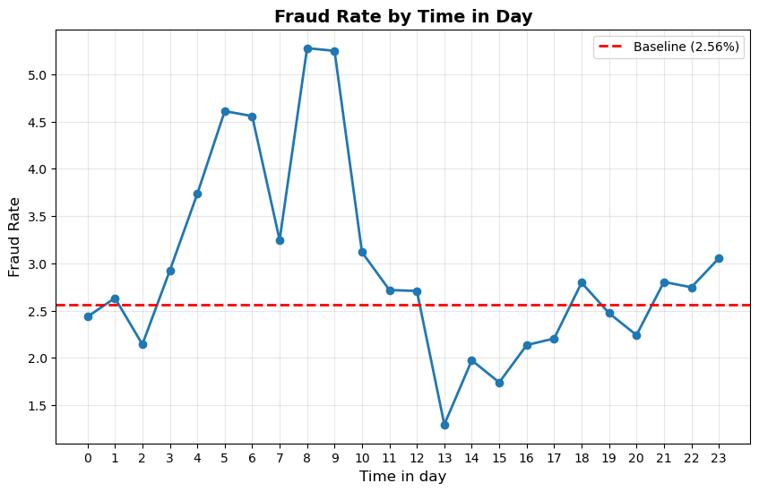
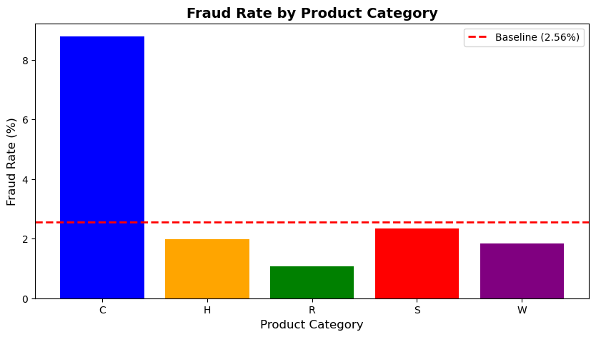
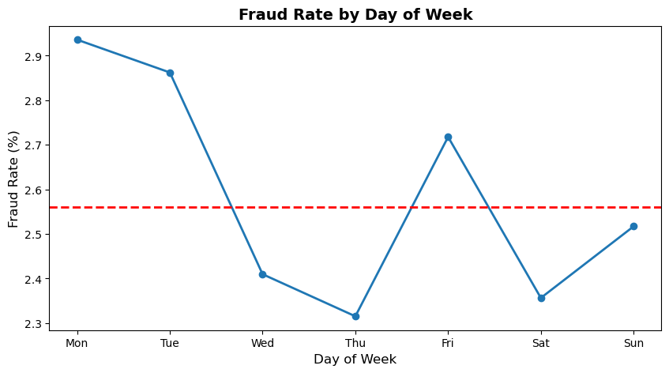

# 💳 Fraud Detection System - E-commerce Transaction Analysis


## 📊 Project Overview

A comprehensive fraud detection system analyzing 100,000 e-commerce transactions to identify fraudulent patterns and build predictive models. This project demonstrates end-to-end data science workflow from exploratory analysis to feature engineering for machine learning deployment.

**Key Challenge:** Highly imbalanced dataset (2.56% fraud rate, 1:38 ratio) requiring specialized techniques beyond simple accuracy metrics.

---

## 🎯 Business Impact

**Fraud Prevention Insights:**
- Identified **Product C** with 8.78% fraud rate (3.4x baseline risk)
- Discovered early morning transactions (4-9am) show 2x baseline fraud rate
- Found credit cards are 1.8x riskier than debit cards
- Quantified compound risk factors for targeted intervention

**Potential Value:**
- Reduced false positives through risk-based authentication
- Optimized fraud team resources with predictive scoring
- Improved customer experience with smart friction

---

## 📁 Dataset

**Source:** IEEE-CIS Fraud Detection (Vesta Corporation)
- **Size:** 100,000 transactions (sampled from 590k due to memory constraints)
- **Features:** 394 columns including transaction details, card info, device data
- **Target:** Binary classification (isFraud: 0 = legitimate, 1 = fraud)
- **Time Period:** 6 months of real e-commerce data

---

## 🔍 Key Findings

### 1. Temporal Patterns
- **High-risk hours:** 4am-9am (fraud rate up to 5.2%)
- **Safe hours:** 1pm-5pm (fraud rate 1.3%)
- **High-risk days:** Monday/Tuesday (2.9% fraud)
- **Pattern:** Fraudsters exploit low-activity periods when cardholders sleep

### 2. Product Type Analysis
| Product | Fraud Rate | Avg Amount | Risk Level |
|---------|-----------|-----------|------------|
| Product C | **8.78%** | $49 | **CRITICAL** |
| Product S | 2.34% | $58 | Low |
| Product H | 1.98% | $72 | Low |
| Product W | 1.85% | $153 | Low |
| Product R | 1.08% | $188 | Very Low |

**Key Insight:** Product C (likely digital goods/gift cards) has highest fraud despite lowest value - fraudsters target items below detection thresholds.

### 3. Transaction Amount Patterns
- **Riskiest range:** $100-500 (2.89% fraud)
- **Safest range:** $1000+ (1.50% fraud)
- **Strategy:** Fraudsters target "sweet spot" - high enough to profit, low enough to avoid flags

### 4. Email Domain Risk
- **Highest risk:** outlook.com (6.91%), hotmail.com (4.63%)
- **Lowest risk:** ISP emails like att.net, comcast.net (0.86%)
- **Critical finding:** Same purchaser/recipient email (P=R) shows 5.17% fraud vs 1.69% for different emails

### 5. Card Information
- **Credit cards:** 3.60% fraud
- **Debit cards:** 2.00% fraud
- **American Express:** 1.14% fraud (premium security)
- **Mastercard:** 2.88% fraud (highest among brands)

### 6. Meta-Pattern Discovery
**Universal trend:** Low transaction volume/unusual behavior correlates with high fraud
- Observed across temporal, product, amount, and email features
- Exception: Premium products (American Express) with robust security

---

## 🛠️ Technical Approach

## 🛠️ Technical Approach

### Phase 1: Exploratory Data Analysis ✅ (COMPLETE)

**Comprehensive analysis across 8 feature groups to identify fraud patterns:**

#### 1. Target Variable Analysis
```
✓ Class distribution: 97.44% legitimate, 2.56% fraud (1:38 imbalance)
✓ Identified accuracy as misleading metric
✓ Established need for precision/recall/F1-score evaluation
```

**Key Learning:** Imbalanced datasets require specialized handling and metrics

#### 2. Transaction Amount Analysis
```
✓ Statistical comparison: Normal ($131 avg) vs Fraud ($134 avg)
✓ Created amount bins to identify patterns
✓ Discovered fraud "sweet spot": $100-500 range (2.89% fraud)
✓ Found safety zone: $1000+ (1.50% fraud - half baseline)
```

**Insight:** Fraudsters target medium amounts - high enough to profit, low enough to avoid flags

#### 3. Temporal Pattern Analysis
```
✓ Hour analysis: 4-9am high risk (5.2%), 1-5pm safe (1.3%)
✓ Day analysis: Monday highest (2.94%), Thursday lowest (2.32%)
✓ Volume-fraud inverse relationship discovered
✓ Created 5-level temporal risk categories
```

**Insight:** Low transaction volume correlates with high fraud - fraudsters exploit quiet periods

#### 4. Missing Data Assessment
```
✓ Assessed 319 columns with missing data
✓ Categorized by severity: <5% (37 cols), 5-60% (109 cols), >60% (173 cols)
✓ Tested predictiveness: D7 missing = 2% fraud, present = 11% fraud
✓ Identified 9 columns with predictive missingness
```

**Discovery:** Missing data can be informative signal, not just noise

#### 5. Product Type Analysis
```
✓ Fraud rates by product: C (8.78%), S (2.34%), H (1.98%), W (1.85%), R (1.08%)
✓ Product C deep dive: $49 avg, nighttime product, 18% fraud at 2pm
✓ Inverse pattern: Low-value products = high fraud
```

**Critical Finding:** Product C (likely digital goods) is 3.4x riskier than baseline

#### 6. Email Domain Analysis
```
✓ Domain risk: Outlook (6.91%), Hotmail (4.63%) vs ISP emails (0.86%)
✓ Email match analysis: P=R same email (5.17%) vs different (1.69%)
✓ Free emails easier to create = higher fraud
```

**Insight:** ISP emails 8x safer than free email providers; gift transactions (P≠R) safer

#### 7. Card Information Analysis
```
✓ Card type: Credit (3.60%) vs Debit (2.00%) - 1.8x difference
✓ Card brand: Mastercard (2.88%), Visa (2.49%), Amex (1.14%)
✓ Premium security effect: Amex safest despite low volume
```

**Finding:** Credit cards more vulnerable; premium cards have better fraud protection

#### 8. Meta-Pattern Discovery
```
✓ Universal pattern: Low volume/unusual behavior = high fraud
✓ Observed across: temporal, product, amount, email features
✓ Exception identified: Premium products (Amex) break pattern
```

**Strategic Insight:** Compound risk factors multiply fraud probability exponentially

---

### Phase 2: Feature Engineering ✅ (COMPLETE)

**Created 51 engineered features transforming EDA insights into model-ready predictors:**

#### Temporal Features (7)
```
✓ hour - Hour of day (0-23) extracted from TransactionDT
✓ day_of_week - Day of week (0-6, Monday=0)
✓ is_weekend - Binary flag for weekend transactions
✓ hour_risk_score - Historical fraud rate by hour
✓ day_risk_score - Historical fraud rate by day
✓ temporal_risk_score - Combined hour + day risk (average)
✓ temporal_risk_category - 5-level risk classification (very_high to very_low)
```

**Implementation:** Captured 2x fraud rate variation across time periods

#### Missing Data Features (9)
```
✓ D4_is_missing through D14_is_missing - Binary flags for predictive columns
✓ Focused on columns with >1.5x fraud rate difference
✓ Key feature: D7_is_missing (5.3x predictive power)
```

**Strategy:** Converted missing data from liability to asset

#### Amount-Based Features (4)
```
✓ amount_category - 5-level categorization (very_low to very_high)
✓ amount_risk_score - Historical fraud rate by amount range
✓ small_amount_early_morning - Binary flag for risky temporal-amount combo
✓ risky_product_C_amount - Product C with medium amounts
```

**Application:** Encoded non-linear fraud-amount relationship

#### Email Features (6)
```
✓ P_email_risk - Fraud rate by purchaser email domain
✓ email_match - Binary flag when purchaser = recipient email (3x risk)
✓ P_email_missing - Binary flag for missing email
✓ risky_email_credit - High-risk email + credit card combination
✓ Retained: P_emaildomain, R_emaildomain for model flexibility
```

**Value:** Captured email provider risk stratification (8x range)

#### Product Features (8)
```
✓ product_risk_score - Historical fraud rate by product type (1-9% range)
✓ is_product_c - Binary flag for critical high-risk product
✓ productC_risky_hours - Product C during 10am-2pm peak fraud window
✓ Product_H, Product_R, Product_S, Product_W - One-hot encoded categories
```

**Impact:** Isolated Product C 3.4x baseline risk

#### Card Features (13)
```
✓ card_type_risk - Fraud rate by card type (credit vs debit)
✓ card_brand_risk - Fraud rate by card brand
✓ is_credit_card - Binary flag for credit cards (1.8x risk multiplier)
✓ CardBrand_discover, CardBrand_mastercard, CardBrand_visa - Encoded brands
✓ CardType_credit, CardType_debit - Encoded types
✓ Retained: card1, card2, card3, card5 for additional patterns
```

**Benefit:** Captured card type and brand risk differentials

#### Interaction Features (4)
```
✓ productC_risky_hours - Product C × high-risk time window
✓ small_amount_early_morning - Amount × temporal risk combination
✓ risky_email_credit - Email × card type risk multiplier
✓ combined_risk_score - Aggregate risk across all dimensions
```

**Innovation:** Captured compound risk - multiple weak signals create strong prediction

---

**Feature Engineering Summary:**
- **Original columns:** 394
- **Engineered features:** 51 new features
- **Final dataset:** 433 columns
- **Approach:** Evidence-based feature creation from EDA patterns
- **Result:** Model-ready dataset with temporal, behavioral, and risk-encoded features

---

### Phase 3: Model Building ⏳ (UPCOMING)

**Planned approach for handling imbalanced classification:**

#### Data Preparation
```
⏳ Feature selection - Remove redundant/low-value columns
⏳ Handle remaining missing values - Imputation strategies
⏳ Train/test split - Stratified sampling to maintain 2.56% fraud rate
⏳ Feature scaling - Normalize numerical features for model performance
```

#### Class Imbalance Handling
```
⏳ SMOTE (Synthetic Minority Over-sampling Technique)
⏳ Class weights adjustment in model training
⏳ Threshold optimization for business objectives
⏳ Ensemble methods for robust predictions
```

#### Model Training & Selection
```
⏳ Baseline model - Logistic Regression for interpretability
⏳ Random Forest - Handle non-linear relationships
⏳ XGBoost/LightGBM - Gradient boosting for best performance
⏳ Hyperparameter tuning - Grid/Random search optimization
```

#### Model Evaluation
```
⏳ Confusion matrix analysis
⏳ Precision, Recall, F1-score (NOT accuracy!)
⏳ ROC-AUC curve for model discrimination
⏳ Business impact quantification
⏳ Feature importance analysis
```

---

### Phase 4: Deployment & Documentation ⏳ (UPCOMING)
```
⏳ Risk scoring system implementation
⏳ Business recommendations and thresholds
⏳ Model explainability (SHAP values)
⏳ Final documentation and presentation
```

---

## 📦 Technologies Used

**Programming & Libraries:**
- Python 3.11
- Pandas (data manipulation)
- NumPy (numerical computing)
- Matplotlib & Seaborn (visualization)
- Scikit-learn (machine learning)

**Environment:**
- Anaconda (conda environments)
- Jupyter Notebook
- VS Code

**Version Control:**
- Git & GitHub

---

## 📊 Key Visualizations

### Fraud Rate by Hour of Day

*Early morning (4-9am) shows 2x baseline fraud rate*

### Fraud Rate by Product Type

*Product C exhibits 8.78% fraud rate - 3.4x baseline*

### Fraud Rate by Day of Week

*Monday shows highest fraud; weekends safer despite higher volume*

---

## 🚀 Getting Started

### Prerequisites
```bash
- Python 3.11+
- Anaconda or pip
- 8GB+ RAM recommended
```

### Installation

1. Clone the repository
```bash
git clone https://github.com/yourusername/fraud-detection.git
cd fraud-detection
```

2. Create conda environment
```bash
conda create -n fraud_env python=3.11
conda activate fraud_env
```

3. Install dependencies
```bash
pip install -r requirements.txt
```

4. Download dataset
- Place `train_transaction.csv` and `train_identity.csv` in `data/raw/` folder

5. Run analysis
```bash
jupyter notebook notebooks/01_data_exploration.ipynb
```

---

## 📂 Project Structure
```
fraud-detection/
├── data/
│   ├── raw/                    # Original datasets
│   └── processed/              # Processed datasets
├── notebooks/
│   ├── 01_data_exploration.ipynb      # EDA & insights
│   ├── 02_feature_engineering.ipynb   # Feature creation
│   ├── 03_model_building.ipynb        # Model training
│   └── 04_evaluation.ipynb            # Results & metrics
├── models/                     # Saved models
├── visualizations/            # Charts and graphs
├── README.md
└── requirements.txt
```

---

## 📈 Results & Insights Summary

### Critical Risk Factors Identified:

**Maximum Risk Scenario (15-20% fraud probability):**
- Product C purchase
- Amount: $100-500
- Time: 10am-2pm on Monday
- Email: outlook.com with P=R match
- Card: Mastercard credit

**Minimum Risk Scenario (<0.5% fraud probability):**
- Product R purchase
- Amount: $1000+
- Time: 3pm on Thursday
- Email: ISP domain with P≠R
- Card: American Express

---

## 🎓 Skills Demonstrated

### Technical Skills
- Exploratory Data Analysis (EDA)
- Feature Engineering
- Handling Imbalanced Datasets
- Statistical Analysis
- Data Visualization
- Machine Learning Classification
- Python Programming

### Business Skills
- Pattern Recognition
- Risk Assessment
- Business Impact Quantification
- Stakeholder Communication
- Strategic Recommendations

---

## 🔮 Future Enhancements

- [ ] Real-time fraud detection API
- [ ] Interactive dashboard (Streamlit/Dash)
- [ ] Deep learning models (LSTM for sequence patterns)
- [ ] Explainable AI (SHAP values for model interpretability)
- [ ] A/B testing framework for fraud rules
- [ ] Cost-benefit analysis calculator

---

## 👤 Author

**[IGEIN EMIATAEHI HOPE]**
- LinkedIn: [linkedin](linkedin.com/in/emi-igein-b024a8147/)
- Portfolio: [GitHub](https://github.com/emiataehi/fraud-detection)
- Email: [emi.igein@gmail.com]

---

## 📄 License

This project is licensed under the MIT License - see LICENSE file for details.

---

## 🙏 Acknowledgments

- Dataset: IEEE-CIS Fraud Detection / Vesta Corporation
- Inspiration: Real-world fraud detection challenges in e-commerce
- Learning: Part of Data Science portfolio development

---

## 📝 Project Status

**Current Phase:** Feature Engineering (60% complete)

**Last Updated:** [25/10/2025]

**Next Milestone:** Model Building & Evaluation